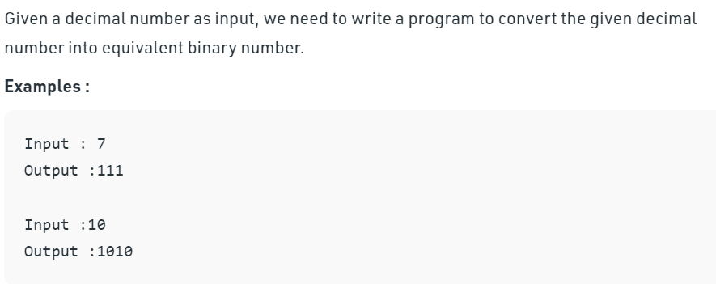

# Interview Question

# Solution

   Let decimal number be 10. 
       Step 1-> 10 % 2 which is equal-too 0 + 10 * ( 10/2 ) % 2 
       Step 2-> 5 % 2 which is equal-too 1 + 10 * ( 5 / 2) % 2
      Step 3-> 2 % 2 which is equal-too 0 + 10 * ( 2 / 2 ) % 2
      Step 4-> 1 % 2 which is equal-too 1 + 10 * ( 1 / 2 ) % 2 

